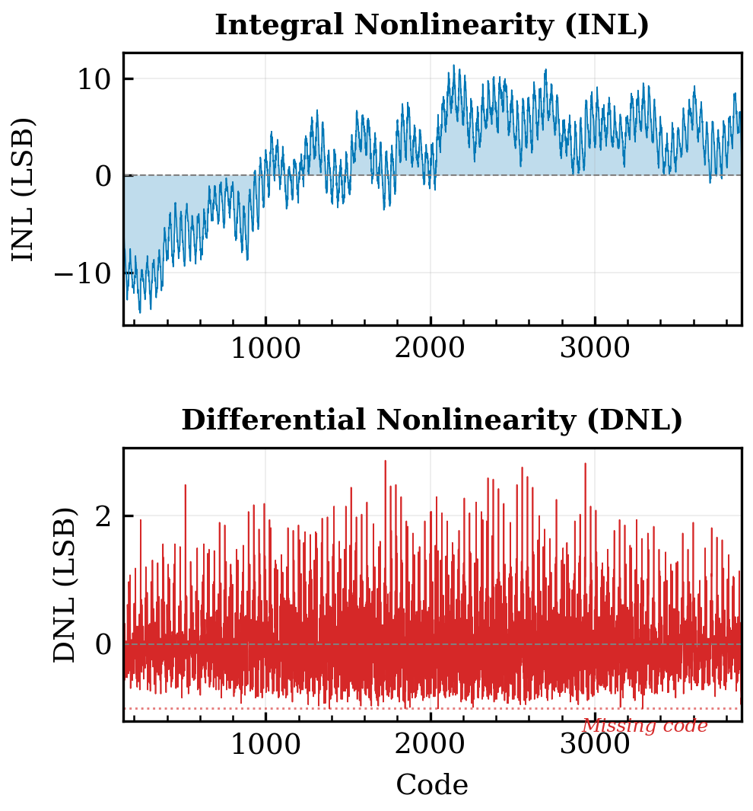
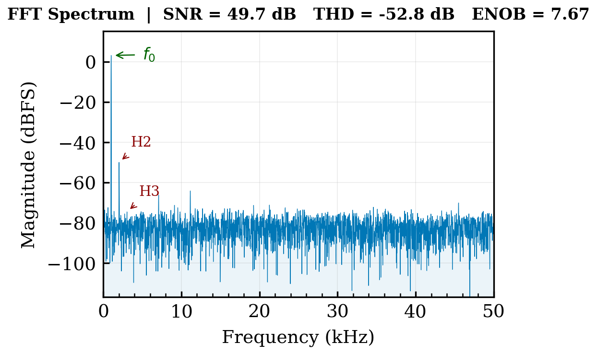
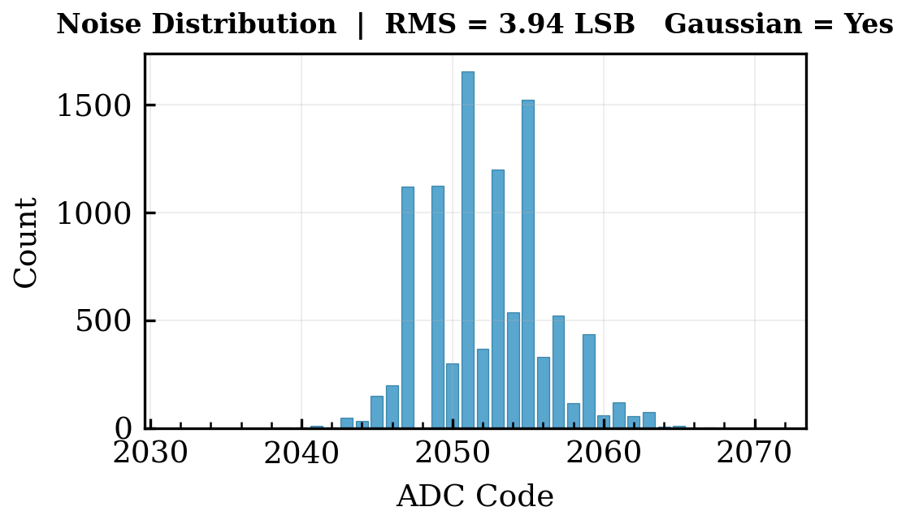

# OpenCharacterize

An open-source platform for automated analog-to-digital converter (ADC) characterization following IEEE Std 1241-2010 methodology.

[](https://www.python.org/downloads/)
[](tests/)
[](LICENSE)
[](docs/OpenCharacterize_Report.pdf)

---

## Objective

The goal of this project is to build a complete, production-grade ADC characterization system that performs the same measurements used in semiconductor validation labs -- static performance (INL, DNL, offset, gain error, missing codes), dynamic performance (SNR, THD, SINAD, SFDR, ENOB), noise analysis, and statistical process control -- and to do it entirely in software using a physics-based virtual ADC model, making the full workflow accessible without expensive lab equipment.

---

## Motivation

ADC characterization is a core task in mixed-signal IC development. Understanding how to measure INL, DNL, and ENOB, how to set up coherent sampling for FFT-based analysis, and how to apply statistical process control to production data are skills that typically require access to lab infrastructure costing tens of thousands of dollars (NI PXI systems, Keithley/Keysight instruments, NI TestStand licenses).

I wanted to build the characterization workflow from scratch -- not just run someone else's tool, but implement every measurement algorithm myself, understand why coherent sampling matters, discover how dead zones corrupt histogram-based INL, and learn what Cpk actually tells you about a process. This project is the result of that effort.

---

## Challenges Faced

**Spectral leakage in FFT-based measurements.** The initial dynamic characterization used a 997 Hz test signal with 8192-point FFT at 100 kHz sample rate. This produced 81.67 cycles in the acquisition window -- not an integer. Even with Blackman-Harris windowing, the resulting spectral leakage reduced the ideal ADC's measured SNR from the expected 74 dB to approximately 50 dB. The root cause: with SNR exceeding 10^7 in power, even 0.01% leakage completely overwhelmed the true noise floor. The fix was coherent sampling with M = 83 (prime, coprime with N = 2^13), giving f_signal = 1013.18 Hz with exactly 83 cycles in the window.

**Dead-zone corruption of static measurements.** The ESP32 ADC model includes input dead zones below 0.13 V and above 3.1 V (matching the real hardware). When the voltage ramp swept the full 0--3.3 V range, rail codes (0 and 4095) accumulated thousands of dead-zone hits, inflating the measured INL to 247 LSB -- far beyond the actual 14 LSB. The solution was to trim the analysis to interior codes with non-zero counts, excluding the rail codes that act as saturation bins. This is standard practice in production testing but not obvious until you see it fail.

**Virtual ADC non-monotonicity.** The INL profile generation initially used inverted frequency mapping for binary-weighted transitions, placing high-amplitude oscillations at high spatial frequencies. This created unrealistic DNL of 5+ LSB per code and caused the transfer function thresholds to become non-monotonic, breaking the quantization logic. Fixing the frequency mapping (MSB = one cycle at full amplitude, LSB = many cycles at small amplitude) and enforcing monotonicity via cumulative maximum accumulation resolved both issues.

**Plotly rendering limitations.** The HTML report plots initially used Plotly for INL/DNL visualization. With 3700+ data points, Plotly's SVG renderer produced invisible sub-pixel lines, and its WebGL mode (Scattergl) silently ignores the fill parameter. Switching to matplotlib with base64-embedded PNG images solved the rendering completely and produced figures suitable for the IEEE technical report.

---

## Tools and Technologies

| Component | Technology | Purpose |
|-----------|-----------|---------|
| Language | Python 3.9+ | Platform implementation |
| Numerical | NumPy, SciPy | Signal processing, FFT, statistics |
| Visualization | Matplotlib | Report plots and publication figures |
| Reports | HTML + base64 PNG | Interactive characterization reports |
| Testing | pytest (19 tests) | Virtual ADC, engine, SPC, calibration |
| Standard | IEEE Std 1241-2010 | Characterization methodology |
| Reference | Analog Devices AN-835 | Code density (histogram) method |

---

## Methodology

### Virtual ADC Model

Rather than using a hardware simulator (which models ideal ADCs with no imperfections), the platform uses a physics-based virtual ADC that injects non-idealities from first principles:

- **Parabolic INL** from systematic capacitor mismatch in the SAR DAC array
- **Binary-weighted periodic INL** from bit-transition discontinuities, with the MSB producing the largest bump at midscale
- **Thermal noise** (kT/C), **flicker noise** (1/f from MOSFET channel traps), and **power supply coupling** at mains frequency
- **Input dead zones** where the ADC cannot resolve voltages (ESP32: below 0.13 V, above 3.1 V)
- **Missing codes** from DNL exceeding -1 LSB at specific transitions

Three pre-configured profiles model ADCs of increasing quality:

| Profile | Based On | Thermal Noise | INL Bow | Dead Zones |
|---------|----------|---------------|---------|------------|
| `esp32` | ESP32 12-bit SAR | 3.5 LSB RMS | 10.0 LSB | 0.13--3.1 V |
| `stm32` | STM32F4 12-bit SAR | 1.2 LSB RMS | 2.0 LSB | None |
| `ideal` | Perfect 12-bit | 0.3 LSB RMS | None | None |

### Characterization Engine

**Static (ramp test):** 200,000-sample linear ramp from 0 V to 3.3 V. Code histogram yields DNL per code; cumulative sum gives endpoint-corrected INL. Rail codes excluded automatically.

**Dynamic (FFT):** Coherent-sampled sine (M=83, N=8192, fs=100 kHz). Blackman-Harris window, 15-bin signal capture for full main lobe. SNR, THD, SINAD, SFDR extracted; ENOB = (SINAD - 1.76) / 6.02.

**Noise (DC input):** 10,000 samples at mid-scale. RMS noise in LSB and microvolts, distribution analysis, Gaussianity test via excess kurtosis.

**Histogram (code density):** 500,000 samples with sine input. Expected density p(code) = 1/(pi*sqrt(A^2 - V^2)) per AN-835. DNL/INL derived from histogram deviation.

### Test Sequencer

Tests are defined in JSON configuration files with pass/fail limits from the DUT datasheet. The sequencer chains tests automatically, generates stimulus waveforms, routes data through the analysis engine, and produces a pass/fail verdict. This mirrors how production test executives (NI TestStand) operate.

### Statistical Process Control

The characterization runs 30 times with independent noise realizations to compute:

- **Cpk** (process capability index) -- quantifies whether the DUT consistently meets spec with margin
- **Gage R&R** -- separates measurement system variation from DUT variation
- **X-bar/R control charts** with Western Electric out-of-control rules

### Calibration Management

Before each test session, the system verifies measurement accuracy against known reference voltages, tracks calibration history in a JSON database, and alerts when drift approaches the error threshold.

---

## Results

### Three-Way ADC Comparison

| Parameter | ESP32 | STM32F4 | Ideal | Unit |
|-----------|-------|---------|-------|------|
| INL (max) | 14.19 | 3.26 | 0.34 | LSB |
| DNL (max) | 2.85 | 0.75 | 0.33 | LSB |
| Offset Error | 24.7 | 2.4 | 0.1 | mV |
| Gain Error | -2.09 | -0.29 | -0.00 | % |
| Missing Codes | 4 | 0 | 0 | -- |
| SNR | 49.3 | 59.0 | 69.6 | dB |
| THD | -53.3 | -66.7 | -86.3 | dB |
| SINAD | 47.8 | 58.3 | 69.5 | dB |
| SFDR | 53.4 | 67.6 | 100.5 | dB |
| ENOB | 7.65 | 9.40 | 11.25 | bits |

*Theoretical 12-bit limit: ENOB = 12.00, SNR = 74.0 dB (6.02N + 1.76)*

The ideal reference validates the measurement framework at 69.6 dB SNR, within 4.4 dB of the theoretical limit. The gap is attributed to 0.3 LSB RMS residual thermal noise above the quantization floor.

### ESP32 Pass/Fail Verdict

| Parameter | Measured | Limit | Result |
|-----------|----------|-------|--------|
| INL max | 14.192 LSB | 12.0 | FAIL |
| DNL max | 2.848 LSB | 2.0 | FAIL |
| Offset Error | 24.678 mV | 40 | PASS |
| Gain Error | 2.092% | 3.0 | PASS |
| Missing Codes | 4 | 0 | FAIL |
| SNR | 49.257 dB | 55.0 | FAIL |
| THD | -53.281 dB | -55.0 | FAIL |
| ENOB | 7.649 bits | 9.0 | FAIL |
| **Overall** | | | **FAIL** |

### Static Characterization (INL / DNL)



The INL plot shows the characteristic parabolic bow of a SAR ADC with capacitor mismatch, ranging from -14.19 to +11.36 LSB. Superimposed periodic oscillations correspond to binary-weighted bit transitions. The DNL plot reveals code-to-code width variation with peaks reaching 2.85 LSB. Four missing codes were identified at codes 1386, 1847, 2048, and 3291 -- the code at 2048 corresponds to the midscale MSB transition, a known weak point in SAR architectures.

### Dynamic Characterization (FFT Spectrum)



The fundamental at 1013 Hz appears at 0 dBFS with the second harmonic (H2) as the dominant distortion component at -50 dB, consistent with even-order nonlinearity from the asymmetric INL profile. The broadband noise floor sits between -80 and -100 dBFS with visible quantization noise texture across the full 50 kHz Nyquist bandwidth.

### Noise Distribution



With a DC input at mid-scale (1.65 V), the noise distribution spans approximately 25 codes centered around code 2051 with an RMS of 3.94 LSB. The distribution is approximately Gaussian, consistent with the dominance of thermal (kT/C) noise over quantization noise at this noise level.

### Process Capability (SPC)

| Parameter | Mean | Std Dev | Cpk | Verdict |
|-----------|------|---------|-----|---------|
| ENOB | 7.67 bits | 0.013 | -33.8 | Not Capable |
| SNR | 49.54 dB | 0.114 | -16.0 | Not Capable |
| INL max | 19.04 LSB | 1.275 | -1.84 | Not Capable |

All parameters show deeply negative Cpk values, confirming the ESP32 ADC cannot meet its specifications. The control chart showed no out-of-control points -- the measurement system is stable, but the DUT is incapable. This is precisely the distinction SPC is designed to surface.

---

## Quick Start

```bash
git clone https://github.com/febrobo/OpenCharacterize.git
cd OpenCharacterize
pip install numpy scipy plotly matplotlib

python main.py                  # Full ESP32 characterization
python main.py --compare        # ESP32 vs STM32 vs Ideal
python main.py --dut stm32      # Characterize STM32
python main.py --spc            # 30-iteration SPC analysis

PYTHONPATH=src python -m pytest tests/ -v   # 19/19 tests
```

---

## Repository Structure

```
OpenCharacterize/
|-- main.py                                 Entry point (CLI)
|-- export_figures.py                       Generate publication PNGs
|-- requirements.txt
|-- pytest.ini
|-- LICENSE
|-- docs/
|   |-- OpenCharacterize_Report.pdf         IEEE technical report
|   |-- fig_inl_dnl.png                     INL/DNL plot (300 DPI)
|   |-- fig_fft.png                         FFT spectrum plot
|   +-- fig_noise.png                       Noise distribution plot
|-- src/
|   |-- virtual_dut/adc_model.py            Physics-based virtual ADC
|   |-- analysis/characterization_engine.py IEEE 1241 measurements
|   |-- tests/test_sequencer.py             JSON-configurable sequencer
|   |-- spc/statistical_process_control.py  Cpk, Gage R&R, control charts
|   |-- calibration/cal_manager.py          Calibration verification
|   +-- reporting/report_generator.py       HTML report generation
|-- configs/
|   +-- full_characterization.json
|-- reports/                                Generated HTML reports
|-- data/                                   Calibration history
+-- tests/
    +-- test_characterization.py            19 unit tests
```

---

## Technical Report

A detailed IEEE-format technical report covering the virtual ADC model, characterization methodology, complete results, and discussion is available at [`docs/OpenCharacterize_Report.pdf`](docs/OpenCharacterize_Report.pdf).

---

## Future Work

- Real hardware integration via SCPI protocol (ESP32 + MCP4725 I2C DAC, BOM under $30)
- Power supply rejection ratio (PSRR) measurement through supply noise injection
- Temperature sweep characterization across operating range
- Multi-channel correlation analysis for crosstalk evaluation

---

## License

MIT

---

*Febin Wilson -- [febin.wilson777@gmail.com](mailto:febin.wilson777@gmail.com) -- [febrobo.github.io](https://febrobo.github.io)*
